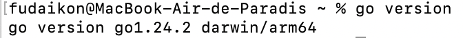

# Small Go Backend for Florian

This repository contains the backend for a simple application that manages a list of user profiles.

## Getting Started

### Prerequisites

You’ll need to have Go installed.

**Mac os**
```
brew install go
```

**Windows** Using the Official Installer

1. Visit the [official Go downloads page](https://go.dev/doc/install).
2. Download the .msi installer for Windows.
3. Run the installer and follow the setup steps (it sets PATH automatically).

Verify the installation (in bash):
```bash
go version
```

You should see output like:


With your own architecture written on the second line.

### Environment Variables

1. Copy the example environment file as `.env`:

```bash
cp .env_example .env
```

2. Edit `.env` and set your own environment variables.

## Running the Backend

In the root directory of the project, run:

```bash
go run main.go
```

## API Overview

This backend exposes a couple of basic APIs.

### Ping Endpoint

Base `URL: /api/ping`

---

URL: `GET /api/ping`

Health check point.

**Response**:
```json
{
  message: "pong"
}
```

---

### Profiles Endpoint

Base `URL: /api/profiles`

---

`GET /api/profiles`

Retrieves the list of all stored profiles.

Response Example: 
```json
{
  "data": [
    {
      "name": "Alice",
      "age": 30
    },
    {
      "name": "Bob",
      "age": 25
    }
  ]
}
```

---

`POST /api/profiles`

Creates a new profile.

**Request Body Example**:
```json
{
  "name": "Charlie",
  "age": 22
}
```

**Response**:
```json
{
  "message": "Profile created successfully"
}
```